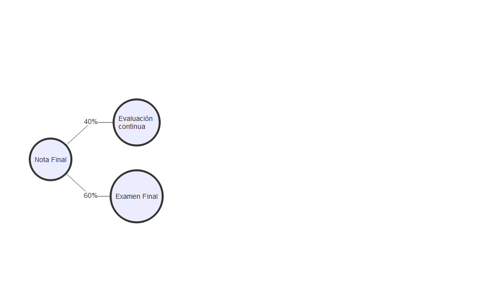

class:  middle

- **Asignatura** 40706 - [MATEMÁTICAS PARA LA ECONOMÍA II](http://www2.ulpgc.es/aplicaciones/proyectosdocentes/pdf.php?id_proyecto=61487&NUEVA=1)

- **Departamento** Métodos Cuantitativos en Economía y Gestión

- **Módulo** Métodos Cuantitativos para la Empresa

- **Tipo** Básica

- **Crédito ECTS** 6 **Curso** 1º **Semestre** 2º
---
class:  middle

# Profesorado

- **Grupo 1** [Christian González](mailto:christian.gonzalez@ulpgc.es)

- **Grupo 2** [Christian González](mailto:christian.gonzalez@ulpgc.es)

---
class:  middle


<ru-blockquote>Christian González Martel</ru-blockquote>

.pull-left[
|                                         |                                         |
| :-------------------------------------- | :-------------------------------------- |
| .RUred[<i class="fas fa-building"></i>]                                           |  D-4.07                |
| <a href="mailto:christian.gonzalez@ulpgc.es">.RUred[<i class="fas fa-clock"></i>] |  Lunes de 9:30 a 11:00 |
|  |  Miércoles de 10:00 a 14:00 |
|  |  Jueves de 9:30 a 11:00 |
| <a href="mailto:christian.gonzalez@ulpgc.es">.RUred[<i class="fas fa-paper-plane"></i>]</a> |  christian.gonzalez@ulpgc.es      |
]

---

class:  inverse, center, middle

# Requisitos previos

---
- Se recomienda que el alumno tenga destreza en el manejo de las herramientas básicas de la **aritmética, del cálculo y del álgebra lineal**.

- Se espera que en la etapa preuniversitaria se hayan adquirido las **nociones básicas** que permitan al alumno **operar sin dificultad**,dominar las técnicas básicas  de **resolución  de  ecuaciones  y  su  interpretación  geométrica plasmada básicamente en la representación de rectas y parábolas.**

- Asímismo,cabe esperar que el alumno esté familiarizado con el **estudio de las funciones elementales, que conozca sus gráficas, continuidad, derivabilidad, además de tener nociones elementales sobre matrices y determinantes.**

- En este sentido, resulta recomendable para el estudiante haber superado la asignatura de **Matemáticas para la Economía I.**

- El alumno deberá tener desarrollada la capacidad de abstracción que permita la compresión de los distintos contenidos de la asignatura, así como su traslado a las distintas aplicaciones en la Economía.
---

class:  inverse, center, middle

# Contribución de la asignatura

---


- Se trata de una asignatura de conocimientos instrumentales dirigida a servir de soporte principal a otras asignaturas cuantitativas del grado tales como la estadística, la econometría u otras matemáticas.

- Además, persigue servir de herramienta al resto de las asignaturas que requieran las técnicas cuantitativas para su desarrollo.

- Esta asignatura pretende dar una formación básica y general que permita acceder en las mejores condiciones posibles a cualquiera de las diversas salidas profesionales para las que capacitan los estudios de Economía.

- De esta manera, se intenta reforzar de manera significativa los perfiles de empleabilidad más habituales para este tipo de estudios en nuestro entorno.

---

class:  inverse, center, middle

# Objetivos de la asignatura


---

1. Tener capacidad de razonamiento y abstracción.

2. Identificar el modelo matemático al que se ajustan los problemas propuestos y plantearlos.

3. Resolver los problemas utilizando diferentes herramientas informáticas en caso necesario.

4. Poder exponer y comunicar las soluciones a los problemas tanto de forma oral como  escrita.

5. Tomar decisiones a partir del análisis de las soluciones obtenidas para los problemas propuestos.

6. Comprender los conceptos básicos de la teoría de funciones en varias variables: continuidad, derivabilidad e integración en una y varias variables y su relación con la teoría económica.

7. Comprender los conceptos básicos de la programación matemática sin restricciones y con restricciones de igualdad.

8. Obtener las cantidades de interés en los problemas propuestos y su análisis posterior.

9. Comprender la interpretación de los multiplicadores de Lagrange.

10. Interpretar correctamente los multiplicadores de Lagrange, así como las variables duales en programación lineal y aplicar dicha interpretación para establecer conclusiones en problemas del ámbito económico-empresarial.


---

class:  inverse, center, middle

# Competencias específicas

---

class:  middle

- **CEA3**. Afianzar el uso del lenguaje simbólico destacando sus ventajas a la hora de realizar una representación clara y concisa de la información así como en la presentación de resultados.

- **CEA4**. Definir un marco conceptual para la formalización y desarrollo de procedimientos teóricos de ayuda a la toma de decisiones.

- **CEA6**. Proporcionar al estudiante los instrumentos básicos del cálculo en varias variables y la optimización para el análisis cuantitativo de la actividad económico-empresarial.

- **CEA7**. Adquirir cierta destreza matemática en la aplicación de los instrumentos en CEA6 en problemas simplificados de la realidad económica.

- **CEA25**. Afianzar el uso del lenguaje informático.


---
class:  inverse, center, middle

# Temario

---

class:  middle

- **Tema 1.** Funciones reales de varias variables.

- **Tema 2.** Cálculo de funciones reales de varias variables.

- **Tema 3.** Introducción a la optimización de funciones reales de varias variables.

- **Tema 4.** Introducción a la programación lineal.


---

class:  middle

- **Tema 1.** Funciones reales de varias variables.

    1. Funciones de varias variables

    2. Dominio y curvas de nivel

    3. Límites y continuidad de funciones de varias variables


---

class:  middle

- **Tema 2.** Cálculo de funciones reales de varias variables

    1. Cálculo de derivadas parciales
    2. La diferencial total
    3. El vector gradiente
    4. Regla de la cadena para derivadas parciales
    5. Derivación implícita de ecuaciones
    6. Cálculo de derivadas parciales de orden superior. Teorema de Schwarz
    7. La matriz hessiana.
    8. Aproximación de funciones de varias variables
    9. Funciones homogéneas
    10. Introducción a la integración múltiple. Integral doble

---

class:  middle

- **Tema 3.** Introducción a la optimización de varias variables.

    1. Planteamiento de un problema de optimización

    2. Optimización sin restricciones

        1. Condición de primer orden

        2. Condición de segundo orden

    3. Optimización con restricciones de igualdad

        1. Aspectos geométricos

        2. Métodos de los multiplicadores de Lagrange

        3. Interpretación  de los multiplicadores de Lagrange

    4. Resultados fundamentales

---


class:  middle

- **Tema 4.** Introducción a la programación lineal.

    1. Conceptos previos: Sistemas de inecuaciones lineales

    2. Planteamiento de un PPL

    3. Resolución gráfica y resultados

    4. Dualidad


---
class:  inverse, center, middle

# Planificación académica

---


.pull-left[
- 📖 **Teoría y ejemplos** 3 horas; *Aula A-2.1*
    - Guiones de clase
    - Relaciones de problemas

- 💻 **Prácticas: Ejercicios** 1  hora;

    - Tema 1-3: Derive
    - Tema 4: [LINGO](https://www.lindo.com/index.php/ls-downloads/try-lingo)
    - Guía de prácticas
    - Material de prácticas

]

.pull-right[
- 👩‍💻 **Aula virtual**

    - Novedades y anuncios
    - Foro de dudas
    - Planificación
    - Cita previa para tutorías
    - Materiales
    - Evaluación continua

]


---
class:  inverse, center, middle

# Bibliografía
---

Dávila, N., E. Gómez, and M. García Artiles (2002). _Ejercicios resueltos de cálculo para la economía y la empresa: Aplicaciones prácticas con DERIVE
(Monografia)_. Spain: Servicio de Publicaciones y Difusión Científica de la ULPGC. ISBN: 84-88412-41-X. URL:
[http://bibproxy.ulpgc.es/login?url=https://search.ebscohost.com/login.aspx?direct=true&db=cat07429a&AN=ulpgc.265593&lang=es&site=eds-live&scope=site](http://bibproxy.ulpgc.es/login?url=https://search.ebscohost.com/login.aspx?direct=true&db=cat07429a&AN=ulpgc.265593&lang=es&site=eds-live&scope=site).

Gómez Déniz, E., M. C. Martel Escobar, N. Dávila Cárdenes, et al. (2002). _Introducción al calculo para la economía y la empresa_. Servicio de
Publicaciones y Difusión Científica de la ULPGC. ISBN: 84-88412-33-9. URL:
[http://bibproxy.ulpgc.es/login?url=https://search.ebscohost.com/login.aspx?direct=true&db=cat07429a&AN=ulpgc.265589&lang=es&site=eds-live&scope=site](http://bibproxy.ulpgc.es/login?url=https://search.ebscohost.com/login.aspx?direct=true&db=cat07429a&AN=ulpgc.265589&lang=es&site=eds-live&scope=site).

Dorta González, P. (2004). _Álgebra lineal y programación lineal para la economía y la empresa_. Spain. ISBN: 8496296105. URL:
[http://bibproxy.ulpgc.es/login?url=https://search.ebscohost.com/login.aspx?direct=true&db=cat07429a&AN=ulpgc.293074&lang=es&site=eds-live&scope=site](http://bibproxy.ulpgc.es/login?url=https://search.ebscohost.com/login.aspx?direct=true&db=cat07429a&AN=ulpgc.293074&lang=es&site=eds-live&scope=site).

Martel Escobar, M. C., J. Andrada Flix, and J. Hernndez Guerra (2004). _Gua interactiva de clculo para la economa y la empresa con Derive (Manual
docente universitario. rea de Ciencias Sociales y Jurdicas)_. Spain: Servicio de Publicaciones y Difusin Cientfica de la ULPGC. ISBN: 8496131920. URL:
[http://bibproxy.ulpgc.es/login?url=https://search.ebscohost.com/login.aspx?direct=true&db=cat07429a&AN=ulpgc.309913&lang=es&site=eds-live&scope=site](http://bibproxy.ulpgc.es/login?url=https://search.ebscohost.com/login.aspx?direct=true&db=cat07429a&AN=ulpgc.309913&lang=es&site=eds-live&scope=site).

---
class:  inverse, center, middle

# Acción tutorial
---

- La **tutoría académica individualizada** se centrará además en las dudas acerca del contenido de la asignatura que puedan surgir a lo largo del aprendizaje del estudiante, tanto como elemento de diagnóstico como de reflexión, proporcionándole la asistencia y la explicación adicional, y complementaria, en las tareas y actividades descritas en el plan de aprendizaje. En este sentido, se tratará de potenciar la capacidad autónoma del estudiante para la mejora de su rendimiento académico.

- La **atención telefónica**, por la naturaleza de la asignatura, se concretará en el asesoramiento académico al estudiante sobre aquellas cuestiones relacionadas con la organización y aspectos generales de la asignatura.

- La **atención virtual (on line)** constituirá una vía de comunicación complementaria a la atención presencial y se establecerá bien por medio del correo electrónico institucional o bien en el aula virtual de la asignatura. En éste último, el estudiante dispone de diversos recursos de comunicación: tablón de anuncios, foros de dudas, etc. Los foros de dudas se consideran espacios de participación entre estudiantes bajo la supervisión del profesor.

---
class:  inverse, center, middle

# Sistema de evaluación
---

class: middle, center


---

# Evaluación contínua (40 ptos.)

<ru-blockquote> 1 prueba de cuestiones cortas + 1 ejercicio a desarrollar **(20 ptos.)**</ru-blockquote>

<ru-blockquote>2 pruebas de ejercicios con ordenador **(2 * 10 ptos. = 20 ptos.)**</ru-blockquote>

<ru-blockquote>La EC es **OBLIGATORIA**</ru-blockquote>

<ru-blockquote>Para poder presentarse a cada prueba de EC es **OBLIGATORIO** que el alumno haya realizado adecuadamente ciertas actividades propuestas a lo largo del semestre.
</ru-blockquote>

---

# Examen final (60 ptos.)

<ru-blockquote>Cuestiones cortas **(30 ptos.)**</ru-blockquote>

<ru-blockquote>Ejercicios a desarrollar **(2 * 15 ptos. = 30 ptos.)**</ru-blockquote>

<ru-blockquote>Las fechas de información pública de los resultados de los exámenes serán anunciadas el día de realización del examen</ru-blockquote>

<ru-blockquote>Las calificaciones y las fechas de revisión de exámenes, se harán públicas en la página web de la asignatura y en el Aula Virtual</ru-blockquote>

---

# Criterios de evaluación

<ru-blockquote>El alumno deberá alcanzar un mínimo de 50 puntos sobre 100 puntos para superar la asignatura.</ru-blockquote>

> El sistema de evaluación será aplicado en la **convocatoria ordinaria** del curso.

> En la **convocatoria extraordinaria y especial**,  el  alumno  se presentará al  100%  de  la calificación  de  la asignatura.


---


```
## Error in data.frame(`Aulas A-0.1,A-0.2` = c("Presentación/Tema1", rep("Tema 1", : los argumentos implican un número diferente de filas: 20, 21
```

<table class=" lightable-paper" style='font-size: 10px; font-family: "Arial Narrow", arial, helvetica, sans-serif; margin-left: auto; margin-right: auto;'>
 <thead>
  <tr>
   <th style="text-align:center;"> SEMANA </th>
   <th style="text-align:center;"> MES </th>
   <th style="text-align:center;"> Lunes </th>
   <th style="text-align:center;"> Martes </th>
   <th style="text-align:center;"> Miércoles </th>
   <th style="text-align:center;"> Jueves </th>
   <th style="text-align:center;"> Viernes </th>
   <th style="text-align:center;"> Aula A-0.1,A-0.2 </th>
   <th style="text-align:center;"> Práctica (D.03) </th>
  </tr>
 </thead>
<tbody>
  <tr>
   <td style="text-align:center;"> 1 </td>
   <td style="text-align:center;"> enero </td>
   <td style="text-align:center;color: black !important;background-color: white !important;"> 27 </td>
   <td style="text-align:center;color: black !important;background-color: white !important;color:  !important;background-color:  !important;"> 28 </td>
   <td style="text-align:center;"> 29 </td>
   <td style="text-align:center;color: black !important;background-color: white !important;"> 30 </td>
   <td style="text-align:center;"> 31 </td>
   <td style="text-align:center;"> Presentación/Tema1 </td>
   <td style="text-align:center;"> Práctica 0 </td>
  </tr>
  <tr>
   <td style="text-align:center;"> 2 </td>
   <td style="text-align:center;"> febrero </td>
   <td style="text-align:center;color: black !important;background-color: white !important;"> 3 </td>
   <td style="text-align:center;color: black !important;background-color: white !important;color:  !important;background-color:  !important;"> 4 </td>
   <td style="text-align:center;"> 5 </td>
   <td style="text-align:center;color: black !important;background-color: white !important;"> 6 </td>
   <td style="text-align:center;"> 7 </td>
   <td style="text-align:center;"> Tema 1 </td>
   <td style="text-align:center;"> Práctica 1 </td>
  </tr>
  <tr>
   <td style="text-align:center;"> 3 </td>
   <td style="text-align:center;"> febrero </td>
   <td style="text-align:center;color: black !important;background-color: white !important;"> 10 </td>
   <td style="text-align:center;color: black !important;background-color: white !important;color:  !important;background-color:  !important;"> 11 </td>
   <td style="text-align:center;"> 12 </td>
   <td style="text-align:center;color: black !important;background-color: white !important;"> 13 </td>
   <td style="text-align:center;"> 14 </td>
   <td style="text-align:center;"> Tema 1 </td>
   <td style="text-align:center;"> Práctica 1 </td>
  </tr>
  <tr>
   <td style="text-align:center;"> 4 </td>
   <td style="text-align:center;"> febrero </td>
   <td style="text-align:center;color: black !important;background-color: white !important;"> 17 </td>
   <td style="text-align:center;color: black !important;background-color: white !important;color:  !important;background-color:  !important;"> 18 </td>
   <td style="text-align:center;"> 19 </td>
   <td style="text-align:center;color: black !important;background-color: white !important;"> 20 </td>
   <td style="text-align:center;"> 21 </td>
   <td style="text-align:center;"> Tema 2 </td>
   <td style="text-align:center;"> Práctica 1 </td>
  </tr>
  <tr>
   <td style="text-align:center;"> 5 </td>
   <td style="text-align:center;"> febrero </td>
   <td style="text-align:center;color: black !important;background-color: white !important;"> 24 </td>
   <td style="text-align:center;color: black !important;background-color: white !important;color:  !important;background-color:  !important;"> 25 </td>
   <td style="text-align:center;"> 26 </td>
   <td style="text-align:center;color: black !important;background-color: white !important;"> 27 </td>
   <td style="text-align:center;"> 28 </td>
   <td style="text-align:center;"> Tema 2 </td>
   <td style="text-align:center;"> Práctica 2 </td>
  </tr>
  <tr>
   <td style="text-align:center;"> 6 </td>
   <td style="text-align:center;"> marzo </td>
   <td style="text-align:center;color: black !important;background-color: white !important;"> 3 </td>
   <td style="text-align:center;color: black !important;background-color: white !important;color:  !important;background-color:  !important;"> 4 </td>
   <td style="text-align:center;"> 5 </td>
   <td style="text-align:center;color: black !important;background-color: white !important;"> 6 </td>
   <td style="text-align:center;"> 7 </td>
   <td style="text-align:center;"> Tema 2 </td>
   <td style="text-align:center;"> Práctica 2 </td>
  </tr>
  <tr>
   <td style="text-align:center;"> 7 </td>
   <td style="text-align:center;"> marzo </td>
   <td style="text-align:center;color: black !important;background-color: white !important;"> 10 </td>
   <td style="text-align:center;color: black !important;background-color: white !important;color:  !important;background-color:  !important;"> 11 </td>
   <td style="text-align:center;"> 12 </td>
   <td style="text-align:center;color: black !important;background-color: white !important;"> 13 </td>
   <td style="text-align:center;"> 14 </td>
   <td style="text-align:center;"> Tema 2 </td>
   <td style="text-align:center;"> Práctica 2 </td>
  </tr>
  <tr>
   <td style="text-align:center;"> 8 </td>
   <td style="text-align:center;"> marzo </td>
   <td style="text-align:center;color: black !important;background-color: white !important;"> 17 </td>
   <td style="text-align:center;color: black !important;background-color: white !important;color:  !important;background-color:  !important;"> 18 </td>
   <td style="text-align:center;"> 19 </td>
   <td style="text-align:center;color: black !important;background-color: white !important;"> 20 </td>
   <td style="text-align:center;"> 21 </td>
   <td style="text-align:center;"> Tema 3 </td>
   <td style="text-align:center;"> Práctica 2 </td>
  </tr>
  <tr>
   <td style="text-align:center;font-weight: bold;color: white !important;background-color: rgba(215, 38, 30, 255) !important;"> 9 </td>
   <td style="text-align:center;font-weight: bold;color: white !important;background-color: rgba(215, 38, 30, 255) !important;"> marzo </td>
   <td style="text-align:center;color: black !important;background-color: white !important;font-weight: bold;color: white !important;background-color: rgba(215, 38, 30, 255) !important;"> 24 </td>
   <td style="text-align:center;color: black !important;background-color: white !important;color:  !important;background-color:  !important;font-weight: bold;color: white !important;background-color: rgba(215, 38, 30, 255) !important;"> 25 </td>
   <td style="text-align:center;font-weight: bold;color: white !important;background-color: rgba(215, 38, 30, 255) !important;"> 26 </td>
   <td style="text-align:center;color: black !important;background-color: white !important;font-weight: bold;color: white !important;background-color: rgba(215, 38, 30, 255) !important;"> 27 </td>
   <td style="text-align:center;font-weight: bold;color: white !important;background-color: rgba(215, 38, 30, 255) !important;"> 28 </td>
   <td style="text-align:center;font-weight: bold;color: white !important;background-color: rgba(215, 38, 30, 255) !important;"> Tema 3 </td>
   <td style="text-align:center;font-weight: bold;color: white !important;background-color: rgba(215, 38, 30, 255) !important;"> Práctica 3 </td>
  </tr>
  <tr>
   <td style="text-align:center;"> 10 </td>
   <td style="text-align:center;"> marzo/abril </td>
   <td style="text-align:center;color: black !important;background-color: white !important;"> 31 </td>
   <td style="text-align:center;color: black !important;background-color: white !important;color:  !important;background-color:  !important;"> 1 </td>
   <td style="text-align:center;"> 2 </td>
   <td style="text-align:center;color: black !important;background-color: white !important;"> 3 </td>
   <td style="text-align:center;"> 4 </td>
   <td style="text-align:center;"> Tema 3 </td>
   <td style="text-align:center;"> Práctica 3 </td>
  </tr>
  <tr>
   <td style="text-align:center;"> 11 </td>
   <td style="text-align:center;"> abril </td>
   <td style="text-align:center;color: black !important;background-color: white !important;"> 7 </td>
   <td style="text-align:center;color: black !important;background-color: white !important;color:  !important;background-color:  !important;"> 8 </td>
   <td style="text-align:center;"> 9 </td>
   <td style="text-align:center;color: white !important;background-color: rgba(49, 200, 84, 255) !important;"> 10 </td>
   <td style="text-align:center;"> 11 </td>
   <td style="text-align:center;"> EC1 09/04/2025 </td>
   <td style="text-align:center;"> Práctica 3 </td>
  </tr>
  <tr>
   <td style="text-align:center;"> 12 </td>
   <td style="text-align:center;"> abril </td>
   <td style="text-align:center;color: black !important;background-color: white !important;"> 14 </td>
   <td style="text-align:center;color: white !important;background-color: rgba(49, 200, 84, 255) !important;color:  !important;background-color:  !important;"> 15 </td>
   <td style="text-align:center;"> 16 </td>
   <td style="text-align:center;color: black !important;background-color: white !important;"> 17 </td>
   <td style="text-align:center;"> 18 </td>
   <td style="text-align:center;"> Tema 4 </td>
   <td style="text-align:center;"> EC1p 10/04/25 </td>
  </tr>
  <tr>
   <td style="text-align:center;"> Semana Santa </td>
   <td style="text-align:center;"> abril </td>
   <td style="text-align:center;color: black !important;background-color: white !important;"> 21 </td>
   <td style="text-align:center;color: black !important;background-color: white !important;color:  !important;background-color:  !important;"> 22 </td>
   <td style="text-align:center;"> 23 </td>
   <td style="text-align:center;color: black !important;background-color: white !important;"> 24 </td>
   <td style="text-align:center;"> 25 </td>
   <td style="text-align:center;">  </td>
   <td style="text-align:center;"> Práctica 4 </td>
  </tr>
  <tr>
   <td style="text-align:center;"> 13 </td>
   <td style="text-align:center;"> abril/mayo </td>
   <td style="text-align:center;color: black !important;background-color: white !important;"> 28 </td>
   <td style="text-align:center;color: black !important;background-color: white !important;color:  !important;background-color:  !important;"> 29 </td>
   <td style="text-align:center;"> 30 </td>
   <td style="text-align:center;color: black !important;background-color: white !important;"> 1 </td>
   <td style="text-align:center;"> 2 </td>
   <td style="text-align:center;"> Tema 4 </td>
   <td style="text-align:center;"> Práctica 4 </td>
  </tr>
  <tr>
   <td style="text-align:center;"> 14 </td>
   <td style="text-align:center;"> mayo </td>
   <td style="text-align:center;color: black !important;background-color: white !important;"> 5 </td>
   <td style="text-align:center;color: black !important;background-color: white !important;color:  !important;background-color:  !important;"> 6 </td>
   <td style="text-align:center;"> 7 </td>
   <td style="text-align:center;color: black !important;background-color: white !important;"> 8 </td>
   <td style="text-align:center;"> 9 </td>
   <td style="text-align:center;"> Tema 4 </td>
   <td style="text-align:center;"> Práctica 4 </td>
  </tr>
  <tr>
   <td style="text-align:center;"> 15 </td>
   <td style="text-align:center;"> mayo </td>
   <td style="text-align:center;color: black !important;background-color: white !important;"> 12 </td>
   <td style="text-align:center;color: black !important;background-color: white !important;color:  !important;background-color:  !important;"> 13 </td>
   <td style="text-align:center;"> 14 </td>
   <td style="text-align:center;color: white !important;background-color: rgba(49, 200, 84, 255) !important;"> 15 </td>
   <td style="text-align:center;"> 16 </td>
   <td style="text-align:center;"> Tema 4 </td>
   <td style="text-align:center;"> EC2p 16/05/2023 </td>
  </tr>
  <tr>
   <td style="text-align:center;">  </td>
   <td style="text-align:center;"> ... </td>
   <td style="text-align:center;color: black !important;background-color: white !important;"> ... </td>
   <td style="text-align:center;color: black !important;background-color: white !important;color:  !important;background-color:  !important;"> ... </td>
   <td style="text-align:center;"> ... </td>
   <td style="text-align:center;color: black !important;background-color: white !important;"> ... </td>
   <td style="text-align:center;"> ... </td>
   <td style="text-align:center;">  </td>
   <td style="text-align:center;">  </td>
  </tr>
  <tr>
   <td style="text-align:center;">  </td>
   <td style="text-align:center;"> junio </td>
   <td style="text-align:center;color: black !important;background-color: white !important;"> 2 </td>
   <td style="text-align:center;color: white !important;background-color: rgba(49, 200, 84, 255) !important;color:  !important;background-color:  !important;"> 3 </td>
   <td style="text-align:center;"> 4 </td>
   <td style="text-align:center;color: black !important;background-color: white !important;"> 5 </td>
   <td style="text-align:center;"> 6 </td>
   <td style="text-align:center;"> Concocatoria ordinaria <a href="https://feet.ulpgc.es/sites/default/files/wp-content/uploads/22_23/CALENDARIOEXAMENESYTFT/calendario_examenes_ge_2022-23.pdf"><i class="fas fa-external-link-alt"></i></a> </td>
   <td style="text-align:center;"> 05/06/2025 </td>
  </tr>
  <tr>
   <td style="text-align:center;">  </td>
   <td style="text-align:center;"> ... </td>
   <td style="text-align:center;color: black !important;background-color: white !important;"> ... </td>
   <td style="text-align:center;color: black !important;background-color: white !important;color:  !important;background-color:  !important;"> ... </td>
   <td style="text-align:center;"> ... </td>
   <td style="text-align:center;color: black !important;background-color: white !important;"> ... </td>
   <td style="text-align:center;"> ... </td>
   <td style="text-align:center;">  </td>
   <td style="text-align:center;">  </td>
  </tr>
  <tr>
   <td style="text-align:center;">  </td>
   <td style="text-align:center;"> julio </td>
   <td style="text-align:center;color: black !important;background-color: white !important;"> 7 </td>
   <td style="text-align:center;color: white !important;background-color: rgba(49, 200, 84, 255) !important;color:  !important;background-color:  !important;"> 8 </td>
   <td style="text-align:center;"> 9 </td>
   <td style="text-align:center;color: black !important;background-color: white !important;"> 10 </td>
   <td style="text-align:center;"> 11 </td>
   <td style="text-align:center;"> Concocatoria extraordinaria  <a href="https://feet.ulpgc.es/sites/default/files/wp-content/uploads/22_23/CALENDARIOEXAMENESYTFT/calendario_examenes_ge_2022-23.pdf"><i class="fas fa-external-link-alt"></i></a> </td>
   <td style="text-align:center;"> 09/07/2025 </td>
  </tr>
</tbody>
</table>
---

class:  middle


<ru-blockquote>Christian González Martel</ru-blockquote>

.pull-left[
|                                         |                                         |
| :-------------------------------------- | :-------------------------------------- |
| .RUred[<i class="fas fa-building"></i>]                                           |  D-4.07                |
| <a href="mailto:christian.gonzalez@ulpgc.es">.RUred[<i class="fas fa-clock"></i>] |  Lunes de 9:30 a 11:00 |
|  |  Miércoles de 10:00 a 14:00 |
|  |  Jueves de 9:30 a 11:00 |
| <a href="mailto:christian.gonzalez@ulpgc.es">.RUred[<i class="fas fa-paper-plane"></i>]</a> |  christian.gonzalez@ulpgc.es      |
]


---
class: middle
background-image: url("/img/logo.png")
background-size: 255px
background-position: 9% 15%

# Matemáticas para la Economía II
